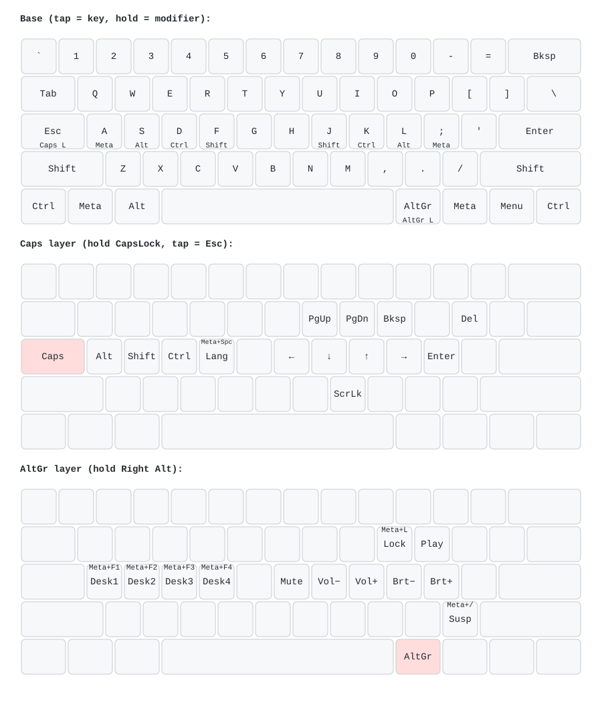

# keyd config

Optimized layout designed to minimize hand movement, reduce wrist strain, improve ergonomics, and maximize productivity.



*The bottom row is drawn as a generic laptop layout and may not match your keyboard exactly.*

## Layers

- **HRM**: Modifiers (Meta, Alt, Ctrl, Shift) are placed directly on the home row (ASDF / JKL;) via dual-function keys. Tap for the character, hold for the modifier.
- **CapsLock**: Acts as `Ctrl` on hold and `Escape` when tapped
- **Space Layer**: Hold `Space` (200ms+) to access navigation, editing and shortcut keys; tap for a regular space. Within 150ms of the previous keypress it is always a plain space, so fast typing never triggers the layer
- **Right Alt (AltGr)**: Uses `Right Alt` on hold to access media controls and system actions

*Note: HRM and Space use custom timeouts. A tap (< 150ms) registers as a character. Holding (> 200ms) or pressing in combination with another key registers as the modifier.*

## Space Layer

**Navigation & Editing**
- `H`, `J`, `K`, `L` → `Left`, `Down`, `Up`, `Right`
- `U`, `I` → `Page Up`, `Page Down`
- `O` → `Backspace`
- `[` → `Delete`
- `;` → `Enter`

**Browser, Tabs, Clipboard**
- `Q` → `Meta + ]` (Brave: tab search panel)
- `W` → `Ctrl + W` (close tab)
- `C`, `V` → `Ctrl + C`, `Ctrl + V` (copy, paste)

**System / Misc**
- `A` → `Meta + Space` (change keyboard layout)
- `M` → `ScrollLock` (voice input using voxtype)

**Symbols**
- `F` → `-` (hyphen)

## RightAlt layer

**System**
- `O` → `Meta + L` (lock screen)
- `/` → `Meta + /` (suspend)

**Media & Brightness**
- `H` → Mute Audio
- `J`, `K` → Volume Down, Volume Up
- `P` → Play/Pause
- `]`, `\` → Previous Song, Next Song
- `L`, `;` → Brightness Down, Brightness Up

## Requirements

- Linux environment
- [keyd](https://github.com/rvaiya/keyd)
- KDE Plasma (for lock screen and suspend shortcuts)

## Installation

1. Install `keyd` from the [official repository](https://github.com/rvaiya/keyd).
2. Copy config file to `/etc/keyd/default.conf`:
   ```bash
   sudo cp default.conf /etc/keyd/
   ```
3. Reload the `keyd` config:
   ```bash
   sudo keyd restart
   ```

## Regenerating the layout image

`assets/layout.svg` is generated from `default.conf` with [keymap-drawer](https://github.com/caksoylar/keymap-drawer). After changing the config, run:

```bash
uv run scripts/draw_layout.py
```

Cursor and Claude Code hooks in this repo do this automatically when an agent edits `default.conf`. See [AGENTS.md](AGENTS.md) for details.

## License

MIT
